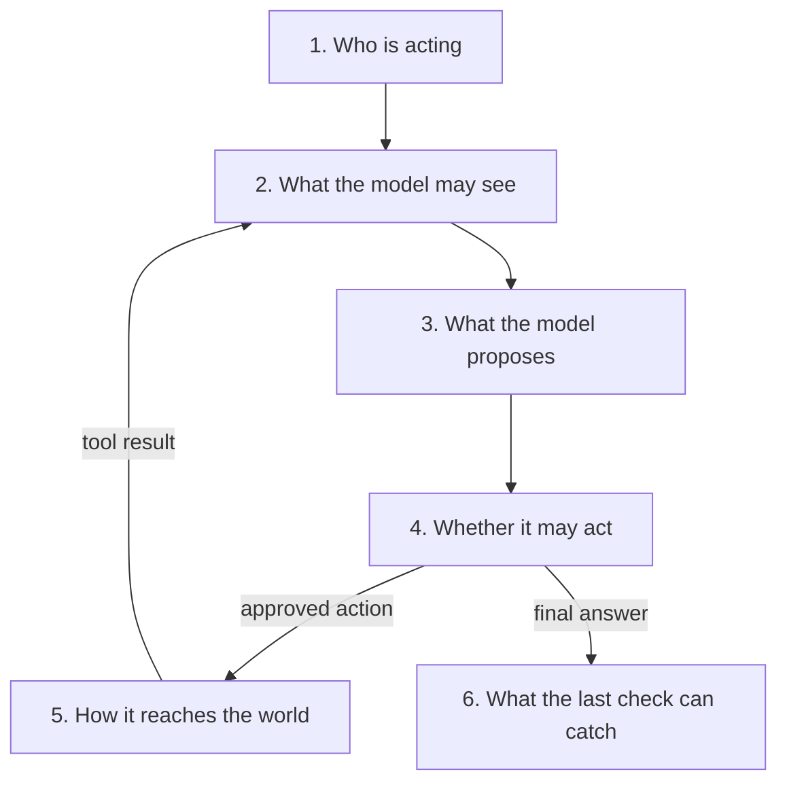
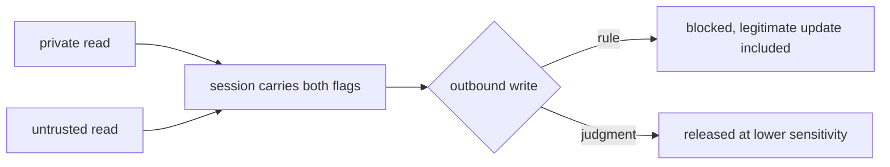
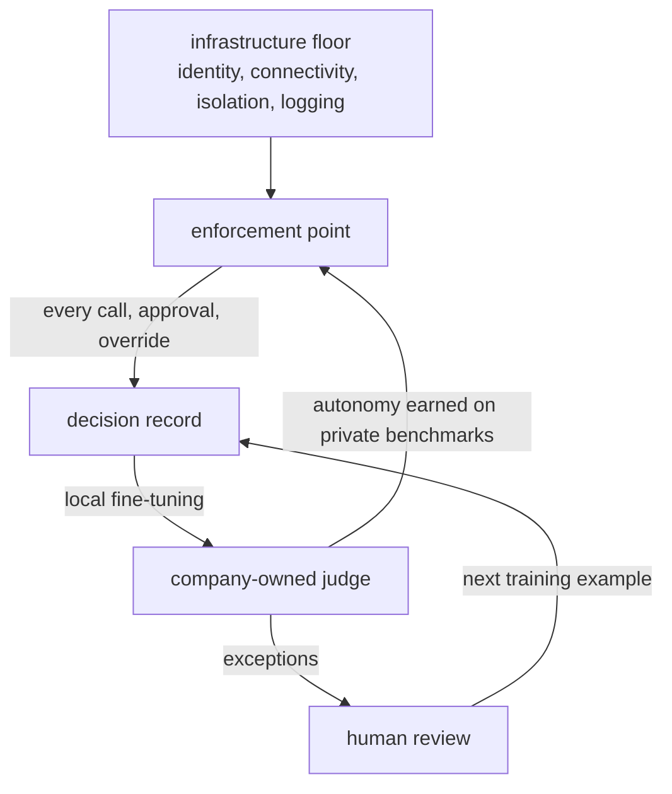

To examine how businesses will manage agent access, consider an employee asking an agent to read an internal outage report and email an update to a customer. Following that task through the agent's execution loop shows where today's approaches work and where they fall short.

## 1. Who is acting

The application begins by identifying the employee and establishing what the agent may do on their behalf. On its execution workers, [GitLab](https://docs.gitlab.com/user/duo_agent_platform/composite_identity/) combines user and agent identities in an OAuth token and restricts operations to permissions held by both. Because the service enforces that restriction, the model cannot expand its authority simply by requesting more access. Identity settles who is acting, and nothing about which reads may safely combine with which later writes.

## 2. What the model may see

The surrounding application, called the harness, then supplies the model with the task, tools, and evidence. Here, it retrieves the outage report after checking access and freshness. Search can locate relevant information, but it cannot establish permission to use it. Those permissions must also be rechecked when saved summaries are reused, so memory cannot bypass revoked access.

## 3. What the model proposes

From that evidence, the model drafts an update and requests a send through a schema with a customer identifier and message body. A well-formed message can still claim permanent recovery when the report only confirms restored service.

## 4. Whether it may act

Several approaches govern whether it may be sent. [SealGate](https://sealgate.ai/docs/admin-guide/policy-rules) evaluates policies over identity, tool arguments, and session history in Common Expression Language, so once private data and untrusted content have both entered a session, an outbound write is held for approval or blocked. That defeats an injected instruction without detecting it, and the limits follow from the same design. The gateway sees only the calls that pass through it, a deterministic engine enforces a wrong label as reliably as a right one, and a derived output inherits the highest sensitivity of anything that influenced it. So the system either blocks every write after a private read, which stops the legitimate update, or it needs a judgment about when a lower-sensitivity release is safe.

For that judgment, [Claude Code's auto mode](https://www.anthropic.com/engineering/claude-code-auto-mode) uses a learned classifier to compare user requests with selected tool calls. It strips tool results as its primary injection defense, so it cannot check the drafted message against the report, which arrived as a tool result. [Shopify's Sidekick](https://help.shopify.com/en/manual/ai-powered-tools/sidekick/set-up) places the decision with merchants, requiring approval before applying store changes. Humans can weigh cases that resist fixed rules, though they misread evidence too, and approving every action slows automation. For the email, release needs someone with disclosure authority approving the exact message, recipient, and source version.

## 5. How it reaches the world

Approved actions reach external systems through connection infrastructure. [Kong](https://developer.konghq.com/plugins/ai-mcp-proxy/) applies access lists to tool discovery and invocation through Model Context Protocol, which standardizes tool interfaces. [Composio](https://docs.composio.dev/docs/tools-direct/authenticating-tools) handles per-user authentication to those tools through OAuth or API keys.

When agents run code, [Cursor](https://cursor.com/blog/agent-sandboxing) restricts Linux filesystem access with Landlock and system calls with seccomp. [Ramp takes a hosted approach](https://modal.com/blog/how-ramp-built-a-full-context-background-coding-agent-on-modal), running each Inspect session inside a Modal Sandbox. These constrain what the agent can reach and close the routes a gateway never sees. An allowed email service can still carry confidential information, so the disclosure check has to happen before the send.

## 6. What the last check can catch

[GitHub's Copilot cloud agent](https://docs.github.com/en/copilot/concepts/agents/cloud-agent/risks-and-mitigations) runs CodeQL, dependency checks, and secret scanning by default, with human review required before merging, and [Salesforce's Einstein Trust Layer](https://developer.salesforce.com/docs/ai/agentforce/guide/trust.html) screens generated text for toxicity. Neither establishes factual accuracy, and a check on the final response cannot retract a disclosure that already left. Evaluation therefore has to measure useful completion alongside prevented violations, since a system that blocks every send prevents every violation.

## Where we're heading

Once the dust settles, identity, connectivity, isolation, and logging will be infrastructure. It will carry labels with data across context, memory, subagents, and generated code. What it cannot settle is when a derived output may leave at a lower sensitivity than its sources. That decision is discretionary, and businesses will own the models that make it. Universal human approval scales labor costs, and generic external models leave training priorities and continued access under suppliers' control. The material for a better judge already exists, since the enforcement point records every call, approval, and override. [Fine-tuning open models locally](https://developer.nvidia.com/blog/from-wafer-out-to-first-token-codifying-supply-chain-expertise-with-nemotron-and-palantir-foundry/) turns that record into reusable expertise without proprietary data leaving the company, and [gains from curated synthetic data](https://www.microsoft.com/en-us/research/publication/textbooks-are-all-you-need-ii-phi-1-5-technical-report/) show how far focused training improves well-defined tasks. Since [expert-curated benchmarks resist saturation](https://arxiv.org/abs/2602.16763), private benchmarks must represent real workflows, test unseen cases, and measure false approvals alongside useful completion. Refreshing them separates improving judgment from memorized answers, so autonomy expands on demonstrated performance. Small non-generative models returning typed, calibrated decisions in milliseconds, [as Jev claims](https://typesafe.ai/blog/introducing-system-one-models-and-jev), would make a check on every call affordable. Permissions remain independently enforced, human review concentrates on exceptions, and each exception becomes the next training example. The advantage compounds through proprietary experience, targeted training, and control over deployment. The gateway ends up where policy, decisions, and training signal meet.

